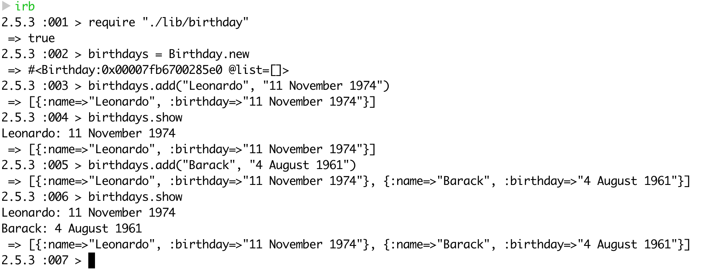

# Birthdays

Simple app to add birthdays and list them

## How to run

Once you have forked/cloned the repo, cd in Birthdays and require the file in an irb as shown below

```
irb
require "./lib/birthday"
birthdays = Birthday.new
birthday.add("Leonardo", "11 November 1974")
birthday.add("Barack", "4 August 1961")
```

## Screenshot of app in action



## Running tests and linter

The following commands must be run in the root directory of the project

1. Testing: ```rspec```
2. Linter: ```rubocop```
